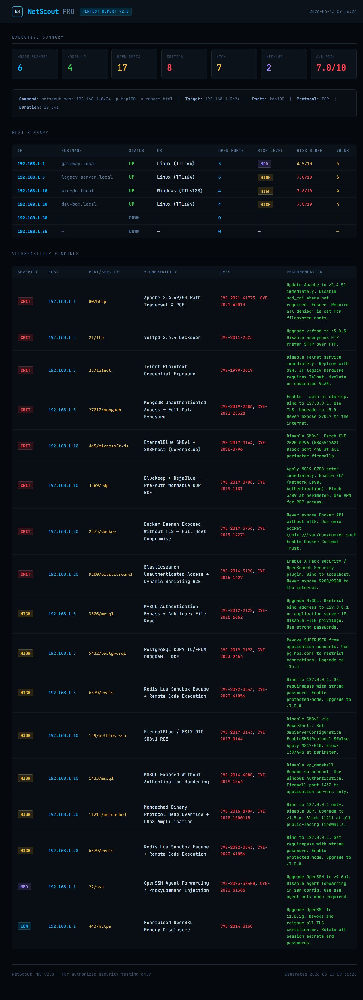

<div align="center">



<br/>

```
███╗   ██╗███████╗████████╗███████╗ ██████╗ ██████╗ ██╗   ██╗████████╗  ██████╗ ██████╗  ██████╗
████╗  ██║██╔════╝╚══██╔══╝██╔════╝██╔════╝██╔═══██╗██║   ██║╚══██╔══╝ ██╔══██╗██╔══██╗██╔═══██╗
██╔██╗ ██║█████╗     ██║   ███████╗██║     ██║   ██║██║   ██║   ██║    ██████╔╝██████╔╝██║   ██║
██║╚██╗██║██╔══╝     ██║   ╚════██║██║     ██║   ██║██║   ██║   ██║    ██╔═══╝ ██╔══██╗██║   ██║
██║ ╚████║███████╗   ██║   ███████║╚██████╗╚██████╔╝╚██████╔╝   ██║    ██║     ██║  ██║╚██████╔╝
╚═╝  ╚═══╝╚══════╝   ╚═╝   ╚══════╝ ╚═════╝ ╚═════╝  ╚═════╝   ╚═╝    ╚═╝     ╚═╝  ╚═╝ ╚═════╝
```

### Network Intelligence & Security Scanner


**A professional network reconnaissance and vulnerability assessment tool.**  
Built entirely in Python · Zero external dependencies · CVE-correlated risk scoring · AI-powered triage

</div>

---

## Overview

NetScout PRO is a fully-featured network security scanner built from the ground up in pure Python. It performs host discovery, port scanning, service fingerprinting, banner grabbing, and automatic vulnerability correlation — producing professional pentest-grade reports in HTML, JSON, XML, and plain text.

It features a 23-entry CVE knowledge base with CVSS-weighted risk scoring, persistent scan history, scan diffing, and optional AI-powered host triage via the Claude API.

---

## Features

| Feature | Details |
|---|---|
| **Host Discovery** | ICMP echo with TTL extraction; TCP fallback when raw sockets unavailable |
| **TCP Connect Scan** | Full 3-way handshake per port, concurrent thread pool |
| **UDP Scan** | Datagram probe + ICMP port-unreachable detection |
| **Banner Grabbing** | Service-aware probes for SSH, HTTP, FTP, SMTP, Redis, MySQL, and more |
| **OS Fingerprinting** | TTL-based heuristic (Linux ≤64, Windows ≤128, Cisco ≤255) |
| **CVE Correlation** | 23-entry vuln database mapping open ports to real CVEs automatically |
| **Risk Scoring** | CVSS-weighted 0–10 host risk score with CRIT/HIGH/MED/LOW classification |
| **Scan History** | Every scan persisted to `~/.netscout/history/` as JSON |
| **Scan Diffing** | Compare any two past scans — surfaces new hosts, opened/closed ports |
| **HTML Report** | Professional dark-theme pentest report (screenshot above) |
| **JSON / XML / TXT** | Machine-readable and terminal-friendly output formats |
| **AI Triage** | Optional Claude-powered host analysis via `--ai` flag |
| **Multi-threading** | Configurable thread pool, scans hundreds of ports per second |
| **Zero Dependencies** | Pure Python 3.10+ standard library only |

---

## Project Structure

```
netscout/
├── netscout.py              ← CLI entry point (run this)
├── setup.py                 ← pip install support
├── requirements.txt         ← no runtime deps
├── LICENSE
├── README.md
├── assets/
│   └── report_screenshot.png
│
├── core/
│   ├── scanner.py           ← TCP/UDP/ICMP scan engine
│   ├── vulndb.py            ← CVE knowledge base + risk scoring
│   ├── diff.py              ← Scan comparison engine
│   └── history.py           ← Persistent scan storage
│
├── reports/
│   ├── html_pro.py          ← Professional HTML report
│   ├── reporter.py          ← JSON + plain text output
│   └── xml_reporter.py      ← Industry-standard XML output
│
├── utils/
│   └── helpers.py           ← Network utilities
│
└── tests/
    └── test_scanner.py      ← 60 unit tests
```

---

## Installation

```bash
# 1. Clone the repository
git clone https://github.com/YOUR_USERNAME/netscout.git
cd netscout

# 2. Verify Python version (3.10+ required)
python --version

# 3. No pip install needed — run directly
python netscout.py --help
```

**Optional:** Install as a system command:
```bash
pip install -e .
netscout --help
```

---

## Usage

### Scanning

```bash
# Single host — top 100 ports
python netscout.py scan 192.168.1.1

# Entire subnet
python netscout.py scan 192.168.1.0/24 -p top100

# IP range with specific ports
python netscout.py scan 192.168.1.1-20 -p 22,80,443,3306,3389

# Save a full HTML pentest report
python netscout.py scan 192.168.1.0/24 -p top100 -o report.html

# UDP scan
python netscout.py scan 192.168.1.1 --udp -p 53,161,123

# Fast scan — more threads, lower timeout
python netscout.py scan 192.168.1.0/24 -p top100 --threads 300 --timeout 0.5

# Scan without banner grabbing (faster)
python netscout.py scan 192.168.1.0/24 -p top1000 --no-banner
```

### Port Specifications

| Spec | Meaning |
|---|---|
| `top20` | 20 most common ports |
| `top100` | 100 most common ports (default) |
| `top1000` | 1000 most common ports |
| `all` | All 65535 ports |
| `22,80,443` | Specific ports |
| `1-1024` | Port range |
| `22,80-82,443` | Mixed |

### History & Diffing

```bash
# List all past scans
python netscout.py history

# View a specific past scan in full
python netscout.py show scan_20260613_120000

# Compare two scans — see what changed
python netscout.py diff scan_20260613_090000 scan_20260613_180000

# Delete a scan from history
python netscout.py delete scan_20260613_090000
```

### All Scan Options

```
positional arguments:
  targets               IP, CIDR (192.168.1.0/24), range (1.1.1.1-20),
                        hostname, or comma-separated list

options:
  -p, --ports PORTS     Port spec: top20/top100/top1000/all/range/csv
  --udp                 UDP scan instead of TCP connect
  -t, --threads N       Parallel threads (default: 150)
  --timeout SEC         Per-port timeout in seconds (default: 1.0)
  --no-banner           Skip banner grabbing (faster)
  --no-vulns            Skip CVE correlation output in terminal
  --skip-ping           Treat all hosts as up (skip discovery)
  -o, --output FILE     Save report (.html .json .xml .txt)
  -v, --verbose         Verbose output
```

---

## How It Works

### Host Discovery
Sends a raw ICMP echo request (hand-crafted using Python's `struct` module) and reads the TTL from the response for OS fingerprinting. Falls back to TCP connect on ports 80/443/22 when raw socket permission is unavailable.

### Port Scanning
TCP Connect scan performs a full three-way handshake per port using `socket.connect_ex()`. A return code of `0` = **OPEN**, any error = **CLOSED**, timeout = **FILTERED**. UDP sends an empty datagram and checks for ICMP port-unreachable responses.

### Banner Grabbing
For open TCP ports, service-specific probes are sent (HTTP HEAD, FTP greeting, SSH identification string, Redis PING, etc.) and the response is captured and stored.

### CVE Correlation & Risk Scoring
Every open port is checked against the built-in vulnerability database. Each matched entry carries a CVSS-weighted severity score. The host's overall risk score (0–10) is computed as a weighted average of all matched vulnerabilities, scaled by hit density.

### Scan History & Diffing
Every scan is automatically saved to `~/.netscout/history/` as a JSON file. The `diff` subcommand compares any two scans and produces a change report: new hosts, hosts that went down, ports that opened or closed, and risk score deltas.

---

## Output Formats

### HTML Report
A self-contained dark-theme pentest report (see screenshot at top). Includes executive summary, per-host table with risk levels, and a full vulnerability findings table with CVE links and remediation guidance.

### JSON
Fully structured machine-readable output — suitable for piping into SIEM tools, dashboards, or custom scripts.

### XML
Industry-standard XML format importable into tools like Metasploit, Burp Suite, and other security platforms.

### Plain Text
Terminal-friendly columnar output suitable for logging and documentation.

---

## Running the Tests

```bash
# Install pytest (dev only)
pip install pytest

# Run all 60 tests
python -m pytest tests/ -v
```

---

## Platform Notes

| Platform | Notes |
|---|---|
| **Linux** | Run with `sudo` for ICMP host discovery. Works without sudo (TCP fallback). |
| **macOS** | Same as Linux — `sudo python netscout.py scan ...` for best results. |
| **Windows** | Run Command Prompt as Administrator for ICMP. TCP fallback works without admin. |
| **Kali Linux** | Runs natively. Already has Python 3.10+. No extra setup needed. |

---

## Legal & Ethical Notice

> ⚠️ **Only scan networks and systems you own or have explicit written permission to test.**
> Unauthorised port scanning may be illegal under the Computer Fraud and Abuse Act (CFAA),
> the Computer Misuse Act (UK), and equivalent laws in most jurisdictions.
> This tool is developed for **educational and authorised security testing purposes only.**

For safe testing without any legal risk:
- Scan `127.0.0.1` (your own machine)
- Use a local virtual machine (VirtualBox / VMware)
- Use intentionally vulnerable VMs: [Metasploitable](https://sourceforge.net/projects/metasploitable/), [DVWA](https://github.com/digininja/DVWA), [HackTheBox](https://www.hackthebox.com/)

---

## Author

**Avinash Bhondave**

Built as a cybersecurity project demonstrating professional-grade network reconnaissance using Python's standard library.

---

## License

Copyright © 2026 Avinash Bhondave  
Released under the [MIT License](LICENSE).
